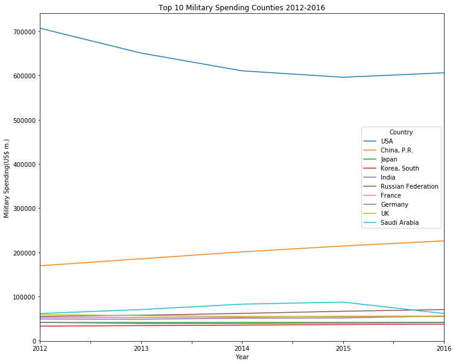
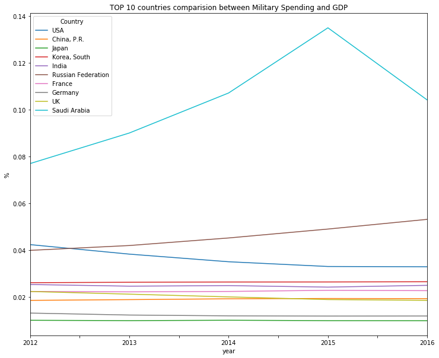
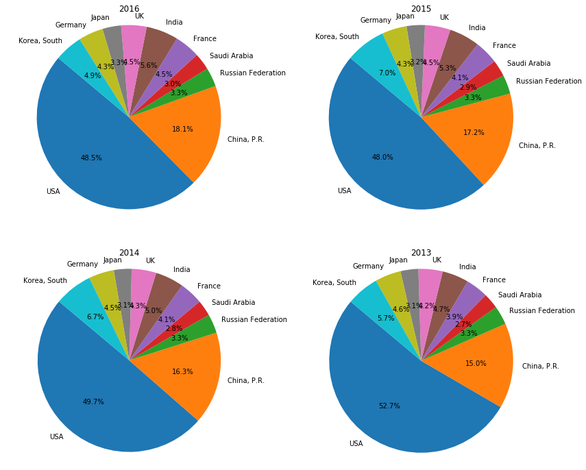
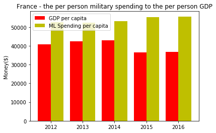
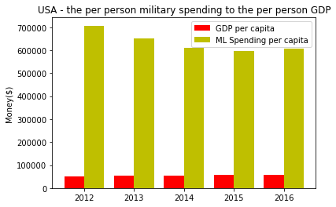
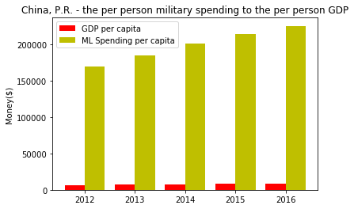
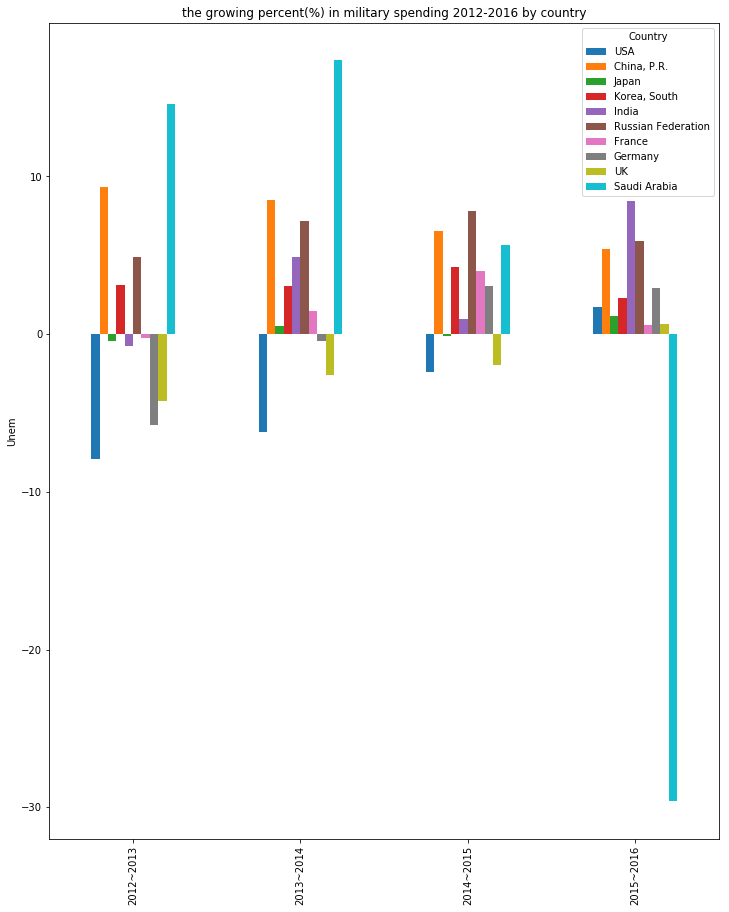
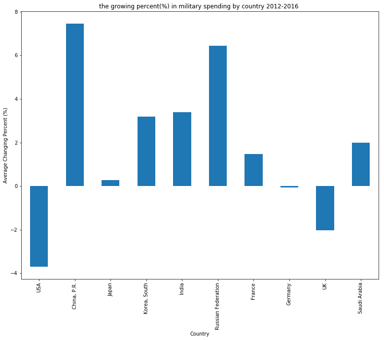

```python
import pandas as pd
import numpy as np
import matplotlib.pyplot as pp
%matplotlib inline

# Data Source: SIPRI Military Expenditure Database 
# https://www.sipri.org/databases/milex/sources-and-methods#sources
#     Excel File Name:SIPRI-Milex-data-1949-2016.xlsx
#     Sheet Name: Constant (2015) USD
#     Choose Columns Name: 'Country', '2012','2013','2014','2015','2016'

# read Military Spending data: 
x1 = pd.ExcelFile('SIPRI-Milex-data-1949-2016.xlsx')
df_all = pd.DataFrame(x1.parse('Constant (2015) USD',skiprows=5))

# Choose last 5 years history
df_ml = df_all.loc[:, ['Country', 2012,2013,2014,2015,2016]]
        
df_ml.head()
```


<div>
<style>
    .dataframe thead tr:only-child th {
        text-align: right;
    }

    .dataframe thead th {
        text-align: left;
    }

    .dataframe tbody tr th {
        vertical-align: top;
    }
</style>
<table border="1" class="dataframe">
  <thead>
    <tr style="text-align: right;">
      <th></th>
      <th>Country</th>
      <th>2012</th>
      <th>2013</th>
      <th>2014</th>
      <th>2015</th>
      <th>2016</th>
    </tr>
  </thead>
  <tbody>
    <tr>
      <th>0</th>
      <td>Africa</td>
      <td>NaN</td>
      <td>NaN</td>
      <td>NaN</td>
      <td>NaN</td>
      <td>NaN</td>
    </tr>
    <tr>
      <th>1</th>
      <td>North Africa</td>
      <td>NaN</td>
      <td>NaN</td>
      <td>NaN</td>
      <td>NaN</td>
      <td>NaN</td>
    </tr>
    <tr>
      <th>2</th>
      <td>Algeria</td>
      <td>8000.81</td>
      <td>8642.23</td>
      <td>9953.06</td>
      <td>10412.7</td>
      <td>10653.8</td>
    </tr>
    <tr>
      <th>3</th>
      <td>Libya</td>
      <td>3109.51</td>
      <td>4053.62</td>
      <td>3737.67</td>
      <td>. .</td>
      <td>. .</td>
    </tr>
    <tr>
      <th>4</th>
      <td>Morocco</td>
      <td>3124.99</td>
      <td>3569.89</td>
      <td>3539.98</td>
      <td>3268.36</td>
      <td>3292.64</td>
    </tr>
  </tbody>
</table>
</div>


```python
# Understand data and Cleaning data

#Skip bottoms for columns description part
df_ml = df_ml.loc[:190]

# Replace '. .','...','xxx' to integer 0
df_ml = df_ml.fillna(0).replace(['. .','...','xxx'], int(0))

# Change year(2012~2016) column name type from integer to string type
df_ml.columns=['Country', '2012','2013','2014','2015','2016']

df_ml.tail() 
```


<div>
<style>
    .dataframe thead tr:only-child th {
        text-align: right;
    }

    .dataframe thead th {
        text-align: left;
    }

    .dataframe tbody tr th {
        vertical-align: top;
    }
</style>
<table border="1" class="dataframe">
  <thead>
    <tr style="text-align: right;">
      <th></th>
      <th>Country</th>
      <th>2012</th>
      <th>2013</th>
      <th>2014</th>
      <th>2015</th>
      <th>2016</th>
    </tr>
  </thead>
  <tbody>
    <tr>
      <th>186</th>
      <td>Syria</td>
      <td>0.000000</td>
      <td>0.000000</td>
      <td>0.000000</td>
      <td>0.000000</td>
      <td>0.000000</td>
    </tr>
    <tr>
      <th>187</th>
      <td>Turkey</td>
      <td>14939.167082</td>
      <td>15309.598207</td>
      <td>15396.558505</td>
      <td>15880.927524</td>
      <td>14973.692996</td>
    </tr>
    <tr>
      <th>188</th>
      <td>UAE</td>
      <td>20485.580876</td>
      <td>25094.476548</td>
      <td>23680.740871</td>
      <td>0.000000</td>
      <td>0.000000</td>
    </tr>
    <tr>
      <th>189</th>
      <td>Yemen</td>
      <td>2518.700818</td>
      <td>2317.494817</td>
      <td>2229.669185</td>
      <td>0.000000</td>
      <td>0.000000</td>
    </tr>
    <tr>
      <th>190</th>
      <td>Yemen, North</td>
      <td>0.000000</td>
      <td>0.000000</td>
      <td>0.000000</td>
      <td>0.000000</td>
      <td>0.000000</td>
    </tr>
  </tbody>
</table>
</div>


```python
pd.options.mode.chained_assignment = None

# Make a function - change to two decimal places format(x.xx)
def makeTwoDecimal(data, startyear, endyear):
    for i in range(startyear, endyear+1):
        data[str(i)] = round(data[str(i)],2)
    
makeTwoDecimal(df_ml, 2012, 2016)

df_ml.head()
```


<div>
<style>
    .dataframe thead tr:only-child th {
        text-align: right;
    }

    .dataframe thead th {
        text-align: left;
    }

    .dataframe tbody tr th {
        vertical-align: top;
    }
</style>
<table border="1" class="dataframe">
  <thead>
    <tr style="text-align: right;">
      <th></th>
      <th>Country</th>
      <th>2012</th>
      <th>2013</th>
      <th>2014</th>
      <th>2015</th>
      <th>2016</th>
    </tr>
  </thead>
  <tbody>
    <tr>
      <th>0</th>
      <td>Africa</td>
      <td>0.00</td>
      <td>0.00</td>
      <td>0.00</td>
      <td>0.00</td>
      <td>0.00</td>
    </tr>
    <tr>
      <th>1</th>
      <td>North Africa</td>
      <td>0.00</td>
      <td>0.00</td>
      <td>0.00</td>
      <td>0.00</td>
      <td>0.00</td>
    </tr>
    <tr>
      <th>2</th>
      <td>Algeria</td>
      <td>8000.81</td>
      <td>8642.23</td>
      <td>9953.06</td>
      <td>10412.71</td>
      <td>10653.84</td>
    </tr>
    <tr>
      <th>3</th>
      <td>Libya</td>
      <td>3109.51</td>
      <td>4053.62</td>
      <td>3737.67</td>
      <td>0.00</td>
      <td>0.00</td>
    </tr>
    <tr>
      <th>4</th>
      <td>Morocco</td>
      <td>3124.99</td>
      <td>3569.89</td>
      <td>3539.98</td>
      <td>3268.36</td>
      <td>3292.64</td>
    </tr>
  </tbody>
</table>
</div>


```python
# Get Top 10 nations by 2016 Military Spending
#•	The military spending of at least the top 10 nations (in military spending)
#o	Choose at least five years of data

# First, Sort 2016 Military Spending data and get First top 10 countries
# Second, Get 5 years data by top 10 countries
# Third, Make a graph using the data

# 1.Sort by Military Spending 2016 and Get top 10 nations Country
df2016top10 = df_ml[['Country','2016']].sort_values(by=['2016'], ascending=False).head(10)

top10 = df2016top10['Country']
top10
```


    71                    USA
    92            China, P.R.
    150    Russian Federation
    185          Saudi Arabia
    159                France
    101                 India
    173                    UK
    93                  Japan
    160               Germany
    95           Korea, South
    Name: Country, dtype: object


```python
# 2. Get 5 years Military Spending of top 10 country data frame (top10)
df_top10 = df_ml.loc[df_ml['Country'].isin(top10)]
df_top10
```


<div>
<style>
    .dataframe thead tr:only-child th {
        text-align: right;
    }

    .dataframe thead th {
        text-align: left;
    }

    .dataframe tbody tr th {
        vertical-align: top;
    }
</style>
<table border="1" class="dataframe">
  <thead>
    <tr style="text-align: right;">
      <th></th>
      <th>Country</th>
      <th>2012</th>
      <th>2013</th>
      <th>2014</th>
      <th>2015</th>
      <th>2016</th>
    </tr>
  </thead>
  <tbody>
    <tr>
      <th>71</th>
      <td>USA</td>
      <td>706918.35</td>
      <td>650851.41</td>
      <td>610636.37</td>
      <td>596009.64</td>
      <td>606232.59</td>
    </tr>
    <tr>
      <th>92</th>
      <td>China, P.R.</td>
      <td>169381.94</td>
      <td>185151.98</td>
      <td>200914.98</td>
      <td>214093.07</td>
      <td>225712.59</td>
    </tr>
    <tr>
      <th>93</th>
      <td>Japan</td>
      <td>41114.24</td>
      <td>40939.56</td>
      <td>41159.00</td>
      <td>41103.23</td>
      <td>41568.98</td>
    </tr>
    <tr>
      <th>95</th>
      <td>Korea, South</td>
      <td>32876.29</td>
      <td>33912.34</td>
      <td>34953.81</td>
      <td>36432.68</td>
      <td>37264.61</td>
    </tr>
    <tr>
      <th>101</th>
      <td>India</td>
      <td>48804.07</td>
      <td>48444.58</td>
      <td>50812.73</td>
      <td>51295.48</td>
      <td>55630.72</td>
    </tr>
    <tr>
      <th>150</th>
      <td>Russian Federation</td>
      <td>54832.44</td>
      <td>57499.77</td>
      <td>61622.35</td>
      <td>66418.71</td>
      <td>70345.06</td>
    </tr>
    <tr>
      <th>159</th>
      <td>France</td>
      <td>52551.44</td>
      <td>52419.43</td>
      <td>53194.66</td>
      <td>55342.13</td>
      <td>55680.57</td>
    </tr>
    <tr>
      <th>160</th>
      <td>Germany</td>
      <td>41179.86</td>
      <td>38802.84</td>
      <td>38627.55</td>
      <td>39812.58</td>
      <td>40985.36</td>
    </tr>
    <tr>
      <th>173</th>
      <td>UK</td>
      <td>58896.07</td>
      <td>56408.48</td>
      <td>54938.47</td>
      <td>53862.19</td>
      <td>54216.84</td>
    </tr>
    <tr>
      <th>185</th>
      <td>Saudi Arabia</td>
      <td>61352.29</td>
      <td>70312.93</td>
      <td>82526.85</td>
      <td>87185.87</td>
      <td>61357.95</td>
    </tr>
  </tbody>
</table>
</div>


```python
#3. For graph, transpose data and plot.line()

#display country from 2012-2016 using transpose()
df_top10Transposed = df_top10.set_index(['Country']).transpose()
df_top10Transposed.head()
```


<div>
<style>
    .dataframe thead tr:only-child th {
        text-align: right;
    }

    .dataframe thead th {
        text-align: left;
    }

    .dataframe tbody tr th {
        vertical-align: top;
    }
</style>
<table border="1" class="dataframe">
  <thead>
    <tr style="text-align: right;">
      <th>Country</th>
      <th>USA</th>
      <th>China, P.R.</th>
      <th>Japan</th>
      <th>Korea, South</th>
      <th>India</th>
      <th>Russian Federation</th>
      <th>France</th>
      <th>Germany</th>
      <th>UK</th>
      <th>Saudi Arabia</th>
    </tr>
  </thead>
  <tbody>
    <tr>
      <th>2012</th>
      <td>706918.35</td>
      <td>169381.94</td>
      <td>41114.24</td>
      <td>32876.29</td>
      <td>48804.07</td>
      <td>54832.44</td>
      <td>52551.44</td>
      <td>41179.86</td>
      <td>58896.07</td>
      <td>61352.29</td>
    </tr>
    <tr>
      <th>2013</th>
      <td>650851.41</td>
      <td>185151.98</td>
      <td>40939.56</td>
      <td>33912.34</td>
      <td>48444.58</td>
      <td>57499.77</td>
      <td>52419.43</td>
      <td>38802.84</td>
      <td>56408.48</td>
      <td>70312.93</td>
    </tr>
    <tr>
      <th>2014</th>
      <td>610636.37</td>
      <td>200914.98</td>
      <td>41159.00</td>
      <td>34953.81</td>
      <td>50812.73</td>
      <td>61622.35</td>
      <td>53194.66</td>
      <td>38627.55</td>
      <td>54938.47</td>
      <td>82526.85</td>
    </tr>
    <tr>
      <th>2015</th>
      <td>596009.64</td>
      <td>214093.07</td>
      <td>41103.23</td>
      <td>36432.68</td>
      <td>51295.48</td>
      <td>66418.71</td>
      <td>55342.13</td>
      <td>39812.58</td>
      <td>53862.19</td>
      <td>87185.87</td>
    </tr>
    <tr>
      <th>2016</th>
      <td>606232.59</td>
      <td>225712.59</td>
      <td>41568.98</td>
      <td>37264.61</td>
      <td>55630.72</td>
      <td>70345.06</td>
      <td>55680.57</td>
      <td>40985.36</td>
      <td>54216.84</td>
      <td>61357.95</td>
    </tr>
  </tbody>
</table>
</div>


```python
# Graph Top 10 coutries Military Spending Data 
Top10TransposedPlot = df_top10Transposed.plot.line(legend=True,
                                                    figsize=(12,10),
                                                    title='Top 10 Military Spending Counties 2012-2016')
Top10TransposedPlot.set_ylabel('Military Spending(US$ m.)')
Top10TransposedPlot.set_xlabel('Year')
pp.show()
```





```python
# •	Compare the data to that country’s GDP

# Military expenditure by country as percentage of gross domestic product
df_gdpall = pd.DataFrame(x1.parse('Share of GDP',skiprows=5))
#Skip bottoms for columns description part
df_gdpall = df_gdpall.loc[:190]

## Clean and Mining Data
# Select Country and 5 years GPD
df_gdp = df_gdpall.loc[:, ['Country', 2012,2013,2014,2015,2016]]

# The Military Spending by GDP for top 10 nations
df_gdptop10 = df_gdp.loc[df_gdp['Country'].isin(top10)]
df_gdptop10
```


<div>
<style>
    .dataframe thead tr:only-child th {
        text-align: right;
    }

    .dataframe thead th {
        text-align: left;
    }

    .dataframe tbody tr th {
        vertical-align: top;
    }
</style>
<table border="1" class="dataframe">
  <thead>
    <tr style="text-align: right;">
      <th></th>
      <th>Country</th>
      <th>2012</th>
      <th>2013</th>
      <th>2014</th>
      <th>2015</th>
      <th>2016</th>
    </tr>
  </thead>
  <tbody>
    <tr>
      <th>71</th>
      <td>USA</td>
      <td>0.0423873</td>
      <td>0.0383251</td>
      <td>0.0350664</td>
      <td>0.0330443</td>
      <td>0.0329269</td>
    </tr>
    <tr>
      <th>92</th>
      <td>China, P.R.</td>
      <td>0.018579</td>
      <td>0.0188982</td>
      <td>0.0192484</td>
      <td>0.0193778</td>
      <td>0.0193193</td>
    </tr>
    <tr>
      <th>93</th>
      <td>Japan</td>
      <td>0.0100784</td>
      <td>0.00991754</td>
      <td>0.0100956</td>
      <td>0.00991031</td>
      <td>0.00988961</td>
    </tr>
    <tr>
      <th>95</th>
      <td>Korea, South</td>
      <td>0.0261298</td>
      <td>0.0263127</td>
      <td>0.0264191</td>
      <td>0.0264412</td>
      <td>0.0265324</td>
    </tr>
    <tr>
      <th>101</th>
      <td>India</td>
      <td>0.0253548</td>
      <td>0.0246412</td>
      <td>0.0248816</td>
      <td>0.024239</td>
      <td>0.0249985</td>
    </tr>
    <tr>
      <th>150</th>
      <td>Russian Federation</td>
      <td>0.0399306</td>
      <td>0.0419934</td>
      <td>0.0452228</td>
      <td>0.049026</td>
      <td>0.0531703</td>
    </tr>
    <tr>
      <th>159</th>
      <td>France</td>
      <td>0.0223895</td>
      <td>0.0222152</td>
      <td>0.0223905</td>
      <td>0.0228789</td>
      <td>0.0227273</td>
    </tr>
    <tr>
      <th>160</th>
      <td>Germany</td>
      <td>0.0131525</td>
      <td>0.012313</td>
      <td>0.0119668</td>
      <td>0.0118752</td>
      <td>0.0119053</td>
    </tr>
    <tr>
      <th>173</th>
      <td>UK</td>
      <td>0.0223697</td>
      <td>0.0212316</td>
      <td>0.0200625</td>
      <td>0.0189138</td>
      <td>0.0185852</td>
    </tr>
    <tr>
      <th>185</th>
      <td>Saudi Arabia</td>
      <td>0.0769773</td>
      <td>0.09004</td>
      <td>0.107136</td>
      <td>0.134962</td>
      <td>0.104135</td>
    </tr>
  </tbody>
</table>
</div>


```python
# Rename GDP columns
df_gdptop10.columns=['Country', '2012','2013','2014','2015','2016']

df_gdptop10
```


<div>
<style>
    .dataframe thead tr:only-child th {
        text-align: right;
    }

    .dataframe thead th {
        text-align: left;
    }

    .dataframe tbody tr th {
        vertical-align: top;
    }
</style>
<table border="1" class="dataframe">
  <thead>
    <tr style="text-align: right;">
      <th></th>
      <th>Country</th>
      <th>2012</th>
      <th>2013</th>
      <th>2014</th>
      <th>2015</th>
      <th>2016</th>
    </tr>
  </thead>
  <tbody>
    <tr>
      <th>71</th>
      <td>USA</td>
      <td>0.0423873</td>
      <td>0.0383251</td>
      <td>0.0350664</td>
      <td>0.0330443</td>
      <td>0.0329269</td>
    </tr>
    <tr>
      <th>92</th>
      <td>China, P.R.</td>
      <td>0.018579</td>
      <td>0.0188982</td>
      <td>0.0192484</td>
      <td>0.0193778</td>
      <td>0.0193193</td>
    </tr>
    <tr>
      <th>93</th>
      <td>Japan</td>
      <td>0.0100784</td>
      <td>0.00991754</td>
      <td>0.0100956</td>
      <td>0.00991031</td>
      <td>0.00988961</td>
    </tr>
    <tr>
      <th>95</th>
      <td>Korea, South</td>
      <td>0.0261298</td>
      <td>0.0263127</td>
      <td>0.0264191</td>
      <td>0.0264412</td>
      <td>0.0265324</td>
    </tr>
    <tr>
      <th>101</th>
      <td>India</td>
      <td>0.0253548</td>
      <td>0.0246412</td>
      <td>0.0248816</td>
      <td>0.024239</td>
      <td>0.0249985</td>
    </tr>
    <tr>
      <th>150</th>
      <td>Russian Federation</td>
      <td>0.0399306</td>
      <td>0.0419934</td>
      <td>0.0452228</td>
      <td>0.049026</td>
      <td>0.0531703</td>
    </tr>
    <tr>
      <th>159</th>
      <td>France</td>
      <td>0.0223895</td>
      <td>0.0222152</td>
      <td>0.0223905</td>
      <td>0.0228789</td>
      <td>0.0227273</td>
    </tr>
    <tr>
      <th>160</th>
      <td>Germany</td>
      <td>0.0131525</td>
      <td>0.012313</td>
      <td>0.0119668</td>
      <td>0.0118752</td>
      <td>0.0119053</td>
    </tr>
    <tr>
      <th>173</th>
      <td>UK</td>
      <td>0.0223697</td>
      <td>0.0212316</td>
      <td>0.0200625</td>
      <td>0.0189138</td>
      <td>0.0185852</td>
    </tr>
    <tr>
      <th>185</th>
      <td>Saudi Arabia</td>
      <td>0.0769773</td>
      <td>0.09004</td>
      <td>0.107136</td>
      <td>0.134962</td>
      <td>0.104135</td>
    </tr>
  </tbody>
</table>
</div>


```python
# For Graph, display GDP from 2007-2013 using transpose()
df_gdptop10Transposed = df_gdptop10.set_index(['Country']).transpose()
df_gdptop10Transposed

```


<div>
<style>
    .dataframe thead tr:only-child th {
        text-align: right;
    }

    .dataframe thead th {
        text-align: left;
    }

    .dataframe tbody tr th {
        vertical-align: top;
    }
</style>
<table border="1" class="dataframe">
  <thead>
    <tr style="text-align: right;">
      <th>Country</th>
      <th>USA</th>
      <th>China, P.R.</th>
      <th>Japan</th>
      <th>Korea, South</th>
      <th>India</th>
      <th>Russian Federation</th>
      <th>France</th>
      <th>Germany</th>
      <th>UK</th>
      <th>Saudi Arabia</th>
    </tr>
  </thead>
  <tbody>
    <tr>
      <th>2012</th>
      <td>0.0423873</td>
      <td>0.018579</td>
      <td>0.0100784</td>
      <td>0.0261298</td>
      <td>0.0253548</td>
      <td>0.0399306</td>
      <td>0.0223895</td>
      <td>0.0131525</td>
      <td>0.0223697</td>
      <td>0.0769773</td>
    </tr>
    <tr>
      <th>2013</th>
      <td>0.0383251</td>
      <td>0.0188982</td>
      <td>0.00991754</td>
      <td>0.0263127</td>
      <td>0.0246412</td>
      <td>0.0419934</td>
      <td>0.0222152</td>
      <td>0.012313</td>
      <td>0.0212316</td>
      <td>0.09004</td>
    </tr>
    <tr>
      <th>2014</th>
      <td>0.0350664</td>
      <td>0.0192484</td>
      <td>0.0100956</td>
      <td>0.0264191</td>
      <td>0.0248816</td>
      <td>0.0452228</td>
      <td>0.0223905</td>
      <td>0.0119668</td>
      <td>0.0200625</td>
      <td>0.107136</td>
    </tr>
    <tr>
      <th>2015</th>
      <td>0.0330443</td>
      <td>0.0193778</td>
      <td>0.00991031</td>
      <td>0.0264412</td>
      <td>0.024239</td>
      <td>0.049026</td>
      <td>0.0228789</td>
      <td>0.0118752</td>
      <td>0.0189138</td>
      <td>0.134962</td>
    </tr>
    <tr>
      <th>2016</th>
      <td>0.0329269</td>
      <td>0.0193193</td>
      <td>0.00988961</td>
      <td>0.0265324</td>
      <td>0.0249985</td>
      <td>0.0531703</td>
      <td>0.0227273</td>
      <td>0.0119053</td>
      <td>0.0185852</td>
      <td>0.104135</td>
    </tr>
  </tbody>
</table>
</div>


```python
# Make a function: Plot line Graph
def makePlotLineGrahph(data, titlevalue, xlabel, ylabel, figsizeX=12, figsizeY=10):
    dataplot = data.plot.line(legend=True, 
                              figsize=(int(figsizeX), int(figsizeY)),
                              title = titlevalue)
    dataplot.set_xlabel(xlabel)
    dataplot.set_ylabel(ylabel)
    pp.show()

makePlotLineGrahph(df_gdptop10Transposed, 'TOP 10 countries comparision between Military Spending and GDP',
                  'year', '%', 12, 10)
```





```python
#•	Compare the data to the overall military spending of the all 10+ countries
fig, ((ax1, ax2),(ax3, ax4)) = pp.subplots(nrows=2, ncols=2, figsize=(14,12))
ax1.pie(df_top10['2016'], labels=top10,autopct='%1.1f%%',
      startangle=140)
ax1.set_title('2016')
ax1.axis('equal')

ax2.pie(df_top10['2015'], labels=top10,autopct='%1.1f%%',
      startangle=140)
ax2.set_title('2015')
ax2.axis('equal')

ax3.pie(df_top10['2014'], labels=top10,autopct='%1.1f%%',
      startangle=140)
ax3.set_title('2014')
ax3.axis('equal')

ax4.pie(df_top10['2013'], labels=top10,autopct='%1.1f%%',
      startangle=140)
ax4.set_title('2013')
ax4.axis('equal')

pp.show()
```





```python
# •	Compare the per person military spending to the per person GDP
# First, get Military Spending per capita data from Excel file(the military spending source)
# Second, get GDP per capita data from THE WORLD BANK site "API_NY.GDP.PCAP.CD_DS2_en_csv_v2.csv"
#    GDP per Capita Source: https://data.worldbank.org/indicator/NY.GDP.PCAP.PP.CD?year_high_desc=true
# Third, Data Mining: Some contries name are different(USA and Uinted State...). Need to make consistency
# Last, Compare Milieary Spending per capita and GDP per capita

#1. GET MILITARY SPENDING per capita
df_mlcapita = pd.DataFrame(x1.parse('Per capita',skiprows=5))
# Skip bottoms: select only 190 rows
df_mlcapita = df_mlcapita.loc[:190]

# Select County and 5 year data 
df_mlcapita = df_all.loc[:, ['Country', 2012,2013,2014,2015,2016]]

# The GDP per capita of top 10 nations
df_mlcapita10 = df_mlcapita.loc[df_mlcapita['Country'].isin(top10)]
df_mlcapita10
```


<div>
<style>
    .dataframe thead tr:only-child th {
        text-align: right;
    }

    .dataframe thead th {
        text-align: left;
    }

    .dataframe tbody tr th {
        vertical-align: top;
    }
</style>
<table border="1" class="dataframe">
  <thead>
    <tr style="text-align: right;">
      <th></th>
      <th>Country</th>
      <th>2012</th>
      <th>2013</th>
      <th>2014</th>
      <th>2015</th>
      <th>2016</th>
    </tr>
  </thead>
  <tbody>
    <tr>
      <th>71</th>
      <td>USA</td>
      <td>706918</td>
      <td>650851</td>
      <td>610636</td>
      <td>596010</td>
      <td>606233</td>
    </tr>
    <tr>
      <th>92</th>
      <td>China, P.R.</td>
      <td>169382</td>
      <td>185152</td>
      <td>200915</td>
      <td>214093</td>
      <td>225713</td>
    </tr>
    <tr>
      <th>93</th>
      <td>Japan</td>
      <td>41114.2</td>
      <td>40939.6</td>
      <td>41159</td>
      <td>41103.2</td>
      <td>41569</td>
    </tr>
    <tr>
      <th>95</th>
      <td>Korea, South</td>
      <td>32876.3</td>
      <td>33912.3</td>
      <td>34953.8</td>
      <td>36432.7</td>
      <td>37264.6</td>
    </tr>
    <tr>
      <th>101</th>
      <td>India</td>
      <td>48804.1</td>
      <td>48444.6</td>
      <td>50812.7</td>
      <td>51295.5</td>
      <td>55630.7</td>
    </tr>
    <tr>
      <th>150</th>
      <td>Russian Federation</td>
      <td>54832.4</td>
      <td>57499.8</td>
      <td>61622.4</td>
      <td>66418.7</td>
      <td>70345.1</td>
    </tr>
    <tr>
      <th>159</th>
      <td>France</td>
      <td>52551.4</td>
      <td>52419.4</td>
      <td>53194.7</td>
      <td>55342.1</td>
      <td>55680.6</td>
    </tr>
    <tr>
      <th>160</th>
      <td>Germany</td>
      <td>41179.9</td>
      <td>38802.8</td>
      <td>38627.6</td>
      <td>39812.6</td>
      <td>40985.4</td>
    </tr>
    <tr>
      <th>173</th>
      <td>UK</td>
      <td>58896.1</td>
      <td>56408.5</td>
      <td>54938.5</td>
      <td>53862.2</td>
      <td>54216.8</td>
    </tr>
    <tr>
      <th>185</th>
      <td>Saudi Arabia</td>
      <td>61352.3</td>
      <td>70312.9</td>
      <td>82526.9</td>
      <td>87185.9</td>
      <td>61358</td>
    </tr>
  </tbody>
</table>
</div>


```python
# Minding and Cleaning Data: Rename Columns, Skip Tail and Replace '. .','...','xxx' to interger 0
# Renmae Columns
df_mlcapita10.columns=['Country', '2012','2013','2014','2015','2016']

# Replace '. .','...','xxx' to interger 0
df_mlcapita10 = df_mlcapita10.fillna(0).replace(['. .','...','xxx'], int(0))
df_mlcapita10
```


<div>
<style>
    .dataframe thead tr:only-child th {
        text-align: right;
    }

    .dataframe thead th {
        text-align: left;
    }

    .dataframe tbody tr th {
        vertical-align: top;
    }
</style>
<table border="1" class="dataframe">
  <thead>
    <tr style="text-align: right;">
      <th></th>
      <th>Country</th>
      <th>2012</th>
      <th>2013</th>
      <th>2014</th>
      <th>2015</th>
      <th>2016</th>
    </tr>
  </thead>
  <tbody>
    <tr>
      <th>71</th>
      <td>USA</td>
      <td>706918.352149</td>
      <td>650851.410032</td>
      <td>610636.367826</td>
      <td>596009.639000</td>
      <td>606232.594296</td>
    </tr>
    <tr>
      <th>92</th>
      <td>China, P.R.</td>
      <td>169381.937923</td>
      <td>185151.984357</td>
      <td>200914.977529</td>
      <td>214093.069946</td>
      <td>225712.587474</td>
    </tr>
    <tr>
      <th>93</th>
      <td>Japan</td>
      <td>41114.235674</td>
      <td>40939.561904</td>
      <td>41159.000112</td>
      <td>41103.226466</td>
      <td>41568.980353</td>
    </tr>
    <tr>
      <th>95</th>
      <td>Korea, South</td>
      <td>32876.286592</td>
      <td>33912.335999</td>
      <td>34953.809865</td>
      <td>36432.680683</td>
      <td>37264.608305</td>
    </tr>
    <tr>
      <th>101</th>
      <td>India</td>
      <td>48804.068174</td>
      <td>48444.579108</td>
      <td>50812.725188</td>
      <td>51295.483754</td>
      <td>55630.721742</td>
    </tr>
    <tr>
      <th>150</th>
      <td>Russian Federation</td>
      <td>54832.441736</td>
      <td>57499.770199</td>
      <td>61622.350132</td>
      <td>66418.708184</td>
      <td>70345.055824</td>
    </tr>
    <tr>
      <th>159</th>
      <td>France</td>
      <td>52551.437567</td>
      <td>52419.425591</td>
      <td>53194.661135</td>
      <td>55342.131529</td>
      <td>55680.569355</td>
    </tr>
    <tr>
      <th>160</th>
      <td>Germany</td>
      <td>41179.860749</td>
      <td>38802.838351</td>
      <td>38627.550251</td>
      <td>39812.576245</td>
      <td>40985.361101</td>
    </tr>
    <tr>
      <th>173</th>
      <td>UK</td>
      <td>58896.067877</td>
      <td>56408.480124</td>
      <td>54938.471846</td>
      <td>53862.185493</td>
      <td>54216.843635</td>
    </tr>
    <tr>
      <th>185</th>
      <td>Saudi Arabia</td>
      <td>61352.286775</td>
      <td>70312.929002</td>
      <td>82526.851545</td>
      <td>87185.866667</td>
      <td>61357.954680</td>
    </tr>
  </tbody>
</table>
</div>


```python
#2. GET GDP per capita from API_NY.GDP.PCAP.CD_DS2_en_csv_v2.csv
# Read csv file
df_gdpcapita = pd.read_csv('API_NY.GDP.PCAP.CD_DS2_en_csv_v2.csv', skiprows=4)

# Select Country Name and 5 year data
df_gdpcapita = df_gdpcapita.loc[:, ['Country Name', '2012','2013','2014','2015','2016']]
df_gdpcapita.head()
```


<div>
<style>
    .dataframe thead tr:only-child th {
        text-align: right;
    }

    .dataframe thead th {
        text-align: left;
    }

    .dataframe tbody tr th {
        vertical-align: top;
    }
</style>
<table border="1" class="dataframe">
  <thead>
    <tr style="text-align: right;">
      <th></th>
      <th>Country Name</th>
      <th>2012</th>
      <th>2013</th>
      <th>2014</th>
      <th>2015</th>
      <th>2016</th>
    </tr>
  </thead>
  <tbody>
    <tr>
      <th>0</th>
      <td>Aruba</td>
      <td>NaN</td>
      <td>NaN</td>
      <td>NaN</td>
      <td>NaN</td>
      <td>NaN</td>
    </tr>
    <tr>
      <th>1</th>
      <td>Afghanistan</td>
      <td>669.009051</td>
      <td>631.744971</td>
      <td>612.069651</td>
      <td>584.025902</td>
      <td>561.778746</td>
    </tr>
    <tr>
      <th>2</th>
      <td>Angola</td>
      <td>4598.249988</td>
      <td>4804.616884</td>
      <td>4709.312024</td>
      <td>3695.793748</td>
      <td>3110.808183</td>
    </tr>
    <tr>
      <th>3</th>
      <td>Albania</td>
      <td>4247.614308</td>
      <td>4414.723140</td>
      <td>4575.763787</td>
      <td>3954.022783</td>
      <td>4146.896250</td>
    </tr>
    <tr>
      <th>4</th>
      <td>Andorra</td>
      <td>38167.095746</td>
      <td>40215.435317</td>
      <td>NaN</td>
      <td>NaN</td>
      <td>NaN</td>
    </tr>
  </tbody>
</table>
</div>


```python
#3. Data Mining and Cleaing
# Clean Data
df_gdpcapita = df_gdpcapita.fillna(0).replace(['. .','...','xxx'], int(0))

# Change top10 name for API_NY.GDP.PCAP.CD_DS2_en_csv_v2.csv
# replace USA, UK, China, Korea
df_gdpcapita = df_gdpcapita.replace('United States', 'USA')
df_gdpcapita = df_gdpcapita.replace('United Kingdom','UK')
df_gdpcapita = df_gdpcapita.replace('China','China, P.R.')
df_gdpcapita = df_gdpcapita.replace('Korea, Rep.','Korea, South')

df_gdpcapita.loc[df_gdpcapita['Country Name']=='UK']
```


<div>
<style>
    .dataframe thead tr:only-child th {
        text-align: right;
    }

    .dataframe thead th {
        text-align: left;
    }

    .dataframe tbody tr th {
        vertical-align: top;
    }
</style>
<table border="1" class="dataframe">
  <thead>
    <tr style="text-align: right;">
      <th></th>
      <th>Country Name</th>
      <th>2012</th>
      <th>2013</th>
      <th>2014</th>
      <th>2015</th>
      <th>2016</th>
    </tr>
  </thead>
  <tbody>
    <tr>
      <th>79</th>
      <td>UK</td>
      <td>41538.307262</td>
      <td>42407.371015</td>
      <td>46412.117271</td>
      <td>43929.690813</td>
      <td>39899.388395</td>
    </tr>
  </tbody>
</table>
</div>


```python
# Get GDP per Capita Top 10 Country
df_gdpcapita10 = df_gdpcapita.loc[df_gdpcapita['Country Name'].isin(top10)]
df_gdpcapita10
```


<div>
<style>
    .dataframe thead tr:only-child th {
        text-align: right;
    }

    .dataframe thead th {
        text-align: left;
    }

    .dataframe tbody tr th {
        vertical-align: top;
    }
</style>
<table border="1" class="dataframe">
  <thead>
    <tr style="text-align: right;">
      <th></th>
      <th>Country Name</th>
      <th>2012</th>
      <th>2013</th>
      <th>2014</th>
      <th>2015</th>
      <th>2016</th>
    </tr>
  </thead>
  <tbody>
    <tr>
      <th>38</th>
      <td>China, P.R.</td>
      <td>6337.882993</td>
      <td>7077.770594</td>
      <td>7683.502038</td>
      <td>8069.211938</td>
      <td>8123.180873</td>
    </tr>
    <tr>
      <th>53</th>
      <td>Germany</td>
      <td>44065.248908</td>
      <td>46530.911428</td>
      <td>47902.652884</td>
      <td>41176.881576</td>
      <td>41936.058575</td>
    </tr>
    <tr>
      <th>75</th>
      <td>France</td>
      <td>40838.024437</td>
      <td>42554.122054</td>
      <td>42955.242866</td>
      <td>36526.770108</td>
      <td>36854.968280</td>
    </tr>
    <tr>
      <th>79</th>
      <td>UK</td>
      <td>41538.307262</td>
      <td>42407.371015</td>
      <td>46412.117271</td>
      <td>43929.690813</td>
      <td>39899.388395</td>
    </tr>
    <tr>
      <th>107</th>
      <td>India</td>
      <td>1446.985410</td>
      <td>1452.195373</td>
      <td>1573.118089</td>
      <td>1613.188708</td>
      <td>1709.387921</td>
    </tr>
    <tr>
      <th>117</th>
      <td>Japan</td>
      <td>48603.476650</td>
      <td>40454.447458</td>
      <td>38096.211505</td>
      <td>34474.137360</td>
      <td>38894.467729</td>
    </tr>
    <tr>
      <th>124</th>
      <td>Korea, South</td>
      <td>24358.782176</td>
      <td>25890.018670</td>
      <td>27811.366384</td>
      <td>27105.076226</td>
      <td>27538.806128</td>
    </tr>
    <tr>
      <th>200</th>
      <td>Russian Federation</td>
      <td>15154.456873</td>
      <td>15543.676532</td>
      <td>14125.906098</td>
      <td>9329.298351</td>
      <td>8748.364504</td>
    </tr>
    <tr>
      <th>203</th>
      <td>Saudi Arabia</td>
      <td>25303.094621</td>
      <td>24934.386142</td>
      <td>24575.403037</td>
      <td>20732.861722</td>
      <td>20028.648207</td>
    </tr>
    <tr>
      <th>249</th>
      <td>USA</td>
      <td>51450.122295</td>
      <td>52787.026949</td>
      <td>54598.550689</td>
      <td>56207.036747</td>
      <td>57466.787113</td>
    </tr>
  </tbody>
</table>
</div>


```python
df_gdpcapita10.columns=['Country Name', 'gdp2012', 'gdp2103', 'gdp2014', 'gdp2015', 'gdp2016']
df_gdpcapita10

#4. Comare the two data frames on Country Name
CompareCapita = df_gdpcapita10.set_index('Country Name').join(df_mlcapita10.set_index('Country')).transpose()  #pd.merge(df_gdpcapita10, df_mlcapita10, on='Country').transpose() 
CompareCapita
```


<div>
<style>
    .dataframe thead tr:only-child th {
        text-align: right;
    }

    .dataframe thead th {
        text-align: left;
    }

    .dataframe tbody tr th {
        vertical-align: top;
    }
</style>
<table border="1" class="dataframe">
  <thead>
    <tr style="text-align: right;">
      <th>Country Name</th>
      <th>China, P.R.</th>
      <th>Germany</th>
      <th>France</th>
      <th>UK</th>
      <th>India</th>
      <th>Japan</th>
      <th>Korea, South</th>
      <th>Russian Federation</th>
      <th>Saudi Arabia</th>
      <th>USA</th>
    </tr>
  </thead>
  <tbody>
    <tr>
      <th>gdp2012</th>
      <td>6337.882993</td>
      <td>44065.248908</td>
      <td>40838.024437</td>
      <td>41538.307262</td>
      <td>1446.985410</td>
      <td>48603.476650</td>
      <td>24358.782176</td>
      <td>15154.456873</td>
      <td>25303.094621</td>
      <td>51450.122295</td>
    </tr>
    <tr>
      <th>gdp2103</th>
      <td>7077.770594</td>
      <td>46530.911428</td>
      <td>42554.122054</td>
      <td>42407.371015</td>
      <td>1452.195373</td>
      <td>40454.447458</td>
      <td>25890.018670</td>
      <td>15543.676532</td>
      <td>24934.386142</td>
      <td>52787.026949</td>
    </tr>
    <tr>
      <th>gdp2014</th>
      <td>7683.502038</td>
      <td>47902.652884</td>
      <td>42955.242866</td>
      <td>46412.117271</td>
      <td>1573.118089</td>
      <td>38096.211505</td>
      <td>27811.366384</td>
      <td>14125.906098</td>
      <td>24575.403037</td>
      <td>54598.550689</td>
    </tr>
    <tr>
      <th>gdp2015</th>
      <td>8069.211938</td>
      <td>41176.881576</td>
      <td>36526.770108</td>
      <td>43929.690813</td>
      <td>1613.188708</td>
      <td>34474.137360</td>
      <td>27105.076226</td>
      <td>9329.298351</td>
      <td>20732.861722</td>
      <td>56207.036747</td>
    </tr>
    <tr>
      <th>gdp2016</th>
      <td>8123.180873</td>
      <td>41936.058575</td>
      <td>36854.968280</td>
      <td>39899.388395</td>
      <td>1709.387921</td>
      <td>38894.467729</td>
      <td>27538.806128</td>
      <td>8748.364504</td>
      <td>20028.648207</td>
      <td>57466.787113</td>
    </tr>
    <tr>
      <th>2012</th>
      <td>169381.937923</td>
      <td>41179.860749</td>
      <td>52551.437567</td>
      <td>58896.067877</td>
      <td>48804.068174</td>
      <td>41114.235674</td>
      <td>32876.286592</td>
      <td>54832.441736</td>
      <td>61352.286775</td>
      <td>706918.352149</td>
    </tr>
    <tr>
      <th>2013</th>
      <td>185151.984357</td>
      <td>38802.838351</td>
      <td>52419.425591</td>
      <td>56408.480124</td>
      <td>48444.579108</td>
      <td>40939.561904</td>
      <td>33912.335999</td>
      <td>57499.770199</td>
      <td>70312.929002</td>
      <td>650851.410032</td>
    </tr>
    <tr>
      <th>2014</th>
      <td>200914.977529</td>
      <td>38627.550251</td>
      <td>53194.661135</td>
      <td>54938.471846</td>
      <td>50812.725188</td>
      <td>41159.000112</td>
      <td>34953.809865</td>
      <td>61622.350132</td>
      <td>82526.851545</td>
      <td>610636.367826</td>
    </tr>
    <tr>
      <th>2015</th>
      <td>214093.069946</td>
      <td>39812.576245</td>
      <td>55342.131529</td>
      <td>53862.185493</td>
      <td>51295.483754</td>
      <td>41103.226466</td>
      <td>36432.680683</td>
      <td>66418.708184</td>
      <td>87185.866667</td>
      <td>596009.639000</td>
    </tr>
    <tr>
      <th>2016</th>
      <td>225712.587474</td>
      <td>40985.361101</td>
      <td>55680.569355</td>
      <td>54216.843635</td>
      <td>55630.721742</td>
      <td>41568.980353</td>
      <td>37264.608305</td>
      <td>70345.055824</td>
      <td>61357.954680</td>
      <td>606232.594296</td>
    </tr>
  </tbody>
</table>
</div>


```python
# Make a function to get 5 years GDP per capita
def GDPPercapityByCountry(country):
    return CompareCapita[country][:5].as_matrix()

# Make a function to get 5 year Military spending per capita
def MLSpendingPercapityByCountry(country):
    return CompareCapita[country][5:].as_matrix()

MLSpendingPercapityByCountry('USA')
```


    array([ 706918.35214941,  650851.41003166,  610636.36782615,
            596009.639     ,  606232.59429645])


```python
# Make a function: Graph Military spending per capita and GDP per capita
def grahpGDPPercapitaMLSendingPercapita(country):
    numberofYear = 5
    width = 0.4                    # the bars widthe
    ind = np.arange(numberofYear)  # the x locations 
    
    GDPercapitaBycountry = GDPPercapityByCountry(country)
    MLPercapitaByCountry = MLSpendingPercapityByCountry(country)
    fig, ax = pp.subplots()
    rects1 = ax.bar(ind, GDPercapitaBycountry, width, color='r')
    rects2 = ax.bar(ind + width, MLPercapitaByCountry, width, color='y')

    # add labels, title and axes ticks
    ax.set_ylabel('Money($)')
    ax.set_title('{} - the per person military spending to the per person GDP'.format(country))
    ax.set_xticks(ind + width / 2)
    ax.set_xticklabels(('2012', '2013', '2014', '2015', '2016'))
    
    ax.legend((rects1[0], rects2[0]), ('GDP per capita', 'ML Spending per capita'))
    pp.show()

grahpGDPPercapitaMLSendingPercapita('France')

```





```python
grahpGDPPercapitaMLSendingPercapita('USA')

```





```python
grahpGDPPercapitaMLSendingPercapita('China, P.R.')

```





```python
#•	Single out the fastest growing countries in military spending in fixed value and in percentage
# First, Add columns and put each year difference and difference percentage
# Second, Add columns and put Average difference and Average difference percentage
# Third, Using Average difference percentage, Make a graph 
# Last, Find the fast growing country

# make a function: return difference with two values
def diff(first, second):
    return first-second

# mamke a function: return different percentage with two values
def diffPercent(first, second):
    return ((first-second)/second)*100

# make a function: Add column in data frame
def addColumn(dfName, columnName, colValue):
    dfName[columnName] = colValue
    
# Make each year difference and add Average differece columns
df_t = df_top10
addColumn(df_t, 'diff2013', diff(df_t['2013'], df_t['2012']))
addColumn(df_t, 'diff2014', diff(df_t['2014'], df_t['2013']))
addColumn(df_t, 'diff2015', diff(df_t['2015'], df_t['2014']))
addColumn(df_t, 'diff2016', diff(df_t['2016'], df_t['2015']))

addColumn(df_t, 'Avgdiff', ((df_t['diff2013']+df_t['diff2014']+df_t['diff2015']+df_t['diff2016'])/4))

df_t
```


<div>
<style>
    .dataframe thead tr:only-child th {
        text-align: right;
    }

    .dataframe thead th {
        text-align: left;
    }

    .dataframe tbody tr th {
        vertical-align: top;
    }
</style>
<table border="1" class="dataframe">
  <thead>
    <tr style="text-align: right;">
      <th></th>
      <th>Country</th>
      <th>2012</th>
      <th>2013</th>
      <th>2014</th>
      <th>2015</th>
      <th>2016</th>
      <th>diff2013</th>
      <th>diff2014</th>
      <th>diff2015</th>
      <th>diff2016</th>
      <th>Avgdiff</th>
    </tr>
  </thead>
  <tbody>
    <tr>
      <th>71</th>
      <td>USA</td>
      <td>706918.35</td>
      <td>650851.41</td>
      <td>610636.37</td>
      <td>596009.64</td>
      <td>606232.59</td>
      <td>-56066.94</td>
      <td>-40215.04</td>
      <td>-14626.73</td>
      <td>10222.95</td>
      <td>-25171.4400</td>
    </tr>
    <tr>
      <th>92</th>
      <td>China, P.R.</td>
      <td>169381.94</td>
      <td>185151.98</td>
      <td>200914.98</td>
      <td>214093.07</td>
      <td>225712.59</td>
      <td>15770.04</td>
      <td>15763.00</td>
      <td>13178.09</td>
      <td>11619.52</td>
      <td>14082.6625</td>
    </tr>
    <tr>
      <th>93</th>
      <td>Japan</td>
      <td>41114.24</td>
      <td>40939.56</td>
      <td>41159.00</td>
      <td>41103.23</td>
      <td>41568.98</td>
      <td>-174.68</td>
      <td>219.44</td>
      <td>-55.77</td>
      <td>465.75</td>
      <td>113.6850</td>
    </tr>
    <tr>
      <th>95</th>
      <td>Korea, South</td>
      <td>32876.29</td>
      <td>33912.34</td>
      <td>34953.81</td>
      <td>36432.68</td>
      <td>37264.61</td>
      <td>1036.05</td>
      <td>1041.47</td>
      <td>1478.87</td>
      <td>831.93</td>
      <td>1097.0800</td>
    </tr>
    <tr>
      <th>101</th>
      <td>India</td>
      <td>48804.07</td>
      <td>48444.58</td>
      <td>50812.73</td>
      <td>51295.48</td>
      <td>55630.72</td>
      <td>-359.49</td>
      <td>2368.15</td>
      <td>482.75</td>
      <td>4335.24</td>
      <td>1706.6625</td>
    </tr>
    <tr>
      <th>150</th>
      <td>Russian Federation</td>
      <td>54832.44</td>
      <td>57499.77</td>
      <td>61622.35</td>
      <td>66418.71</td>
      <td>70345.06</td>
      <td>2667.33</td>
      <td>4122.58</td>
      <td>4796.36</td>
      <td>3926.35</td>
      <td>3878.1550</td>
    </tr>
    <tr>
      <th>159</th>
      <td>France</td>
      <td>52551.44</td>
      <td>52419.43</td>
      <td>53194.66</td>
      <td>55342.13</td>
      <td>55680.57</td>
      <td>-132.01</td>
      <td>775.23</td>
      <td>2147.47</td>
      <td>338.44</td>
      <td>782.2825</td>
    </tr>
    <tr>
      <th>160</th>
      <td>Germany</td>
      <td>41179.86</td>
      <td>38802.84</td>
      <td>38627.55</td>
      <td>39812.58</td>
      <td>40985.36</td>
      <td>-2377.02</td>
      <td>-175.29</td>
      <td>1185.03</td>
      <td>1172.78</td>
      <td>-48.6250</td>
    </tr>
    <tr>
      <th>173</th>
      <td>UK</td>
      <td>58896.07</td>
      <td>56408.48</td>
      <td>54938.47</td>
      <td>53862.19</td>
      <td>54216.84</td>
      <td>-2487.59</td>
      <td>-1470.01</td>
      <td>-1076.28</td>
      <td>354.65</td>
      <td>-1169.8075</td>
    </tr>
    <tr>
      <th>185</th>
      <td>Saudi Arabia</td>
      <td>61352.29</td>
      <td>70312.93</td>
      <td>82526.85</td>
      <td>87185.87</td>
      <td>61357.95</td>
      <td>8960.64</td>
      <td>12213.92</td>
      <td>4659.02</td>
      <td>-25827.92</td>
      <td>1.4150</td>
    </tr>
  </tbody>
</table>
</div>


```python
# Make each year difference Percentage and add average difference percentage columns
addColumn(df_t, 'diffPercent2013', diffPercent(df_t['2013'], df_t['2012']))
addColumn(df_t, 'diffPercent2014', diffPercent(df_t['2014'], df_t['2013']))
addColumn(df_t, 'diffPercent2015', diffPercent(df_t['2015'], df_t['2014']))
addColumn(df_t, 'diffPercent2016', diffPercent(df_t['2016'], df_t['2015']))

addColumn(df_t, 'AvgPercentdiff', ((df_t['diffPercent2013']+df_t['diffPercent2014']
                                      +df_t['diffPercent2015']+df_t['diffPercent2016'])/4))

df_t
```


<div>
<style>
    .dataframe thead tr:only-child th {
        text-align: right;
    }

    .dataframe thead th {
        text-align: left;
    }

    .dataframe tbody tr th {
        vertical-align: top;
    }
</style>
<table border="1" class="dataframe">
  <thead>
    <tr style="text-align: right;">
      <th></th>
      <th>Country</th>
      <th>2012</th>
      <th>2013</th>
      <th>2014</th>
      <th>2015</th>
      <th>2016</th>
      <th>diff2013</th>
      <th>diff2014</th>
      <th>diff2015</th>
      <th>diff2016</th>
      <th>Avgdiff</th>
      <th>diffPercent2013</th>
      <th>diffPercent2014</th>
      <th>diffPercent2015</th>
      <th>diffPercent2016</th>
      <th>AvgPercentdiff</th>
    </tr>
  </thead>
  <tbody>
    <tr>
      <th>71</th>
      <td>USA</td>
      <td>706918.35</td>
      <td>650851.41</td>
      <td>610636.37</td>
      <td>596009.64</td>
      <td>606232.59</td>
      <td>-56066.94</td>
      <td>-40215.04</td>
      <td>-14626.73</td>
      <td>10222.95</td>
      <td>-25171.4400</td>
      <td>-7.931176</td>
      <td>-6.178836</td>
      <td>-2.395326</td>
      <td>1.715232</td>
      <td>-3.697526</td>
    </tr>
    <tr>
      <th>92</th>
      <td>China, P.R.</td>
      <td>169381.94</td>
      <td>185151.98</td>
      <td>200914.98</td>
      <td>214093.07</td>
      <td>225712.59</td>
      <td>15770.04</td>
      <td>15763.00</td>
      <td>13178.09</td>
      <td>11619.52</td>
      <td>14082.6625</td>
      <td>9.310343</td>
      <td>8.513547</td>
      <td>6.559038</td>
      <td>5.427322</td>
      <td>7.452562</td>
    </tr>
    <tr>
      <th>93</th>
      <td>Japan</td>
      <td>41114.24</td>
      <td>40939.56</td>
      <td>41159.00</td>
      <td>41103.23</td>
      <td>41568.98</td>
      <td>-174.68</td>
      <td>219.44</td>
      <td>-55.77</td>
      <td>465.75</td>
      <td>113.6850</td>
      <td>-0.424865</td>
      <td>0.536010</td>
      <td>-0.135499</td>
      <td>1.133123</td>
      <td>0.277192</td>
    </tr>
    <tr>
      <th>95</th>
      <td>Korea, South</td>
      <td>32876.29</td>
      <td>33912.34</td>
      <td>34953.81</td>
      <td>36432.68</td>
      <td>37264.61</td>
      <td>1036.05</td>
      <td>1041.47</td>
      <td>1478.87</td>
      <td>831.93</td>
      <td>1097.0800</td>
      <td>3.151359</td>
      <td>3.071065</td>
      <td>4.230926</td>
      <td>2.283472</td>
      <td>3.184206</td>
    </tr>
    <tr>
      <th>101</th>
      <td>India</td>
      <td>48804.07</td>
      <td>48444.58</td>
      <td>50812.73</td>
      <td>51295.48</td>
      <td>55630.72</td>
      <td>-359.49</td>
      <td>2368.15</td>
      <td>482.75</td>
      <td>4335.24</td>
      <td>1706.6625</td>
      <td>-0.736598</td>
      <td>4.888369</td>
      <td>0.950057</td>
      <td>8.451505</td>
      <td>3.388333</td>
    </tr>
    <tr>
      <th>150</th>
      <td>Russian Federation</td>
      <td>54832.44</td>
      <td>57499.77</td>
      <td>61622.35</td>
      <td>66418.71</td>
      <td>70345.06</td>
      <td>2667.33</td>
      <td>4122.58</td>
      <td>4796.36</td>
      <td>3926.35</td>
      <td>3878.1550</td>
      <td>4.864511</td>
      <td>7.169733</td>
      <td>7.783475</td>
      <td>5.911512</td>
      <td>6.432308</td>
    </tr>
    <tr>
      <th>159</th>
      <td>France</td>
      <td>52551.44</td>
      <td>52419.43</td>
      <td>53194.66</td>
      <td>55342.13</td>
      <td>55680.57</td>
      <td>-132.01</td>
      <td>775.23</td>
      <td>2147.47</td>
      <td>338.44</td>
      <td>782.2825</td>
      <td>-0.251201</td>
      <td>1.478898</td>
      <td>4.037003</td>
      <td>0.611541</td>
      <td>1.469060</td>
    </tr>
    <tr>
      <th>160</th>
      <td>Germany</td>
      <td>41179.86</td>
      <td>38802.84</td>
      <td>38627.55</td>
      <td>39812.58</td>
      <td>40985.36</td>
      <td>-2377.02</td>
      <td>-175.29</td>
      <td>1185.03</td>
      <td>1172.78</td>
      <td>-48.6250</td>
      <td>-5.772288</td>
      <td>-0.451745</td>
      <td>3.067836</td>
      <td>2.945752</td>
      <td>-0.052611</td>
    </tr>
    <tr>
      <th>173</th>
      <td>UK</td>
      <td>58896.07</td>
      <td>56408.48</td>
      <td>54938.47</td>
      <td>53862.19</td>
      <td>54216.84</td>
      <td>-2487.59</td>
      <td>-1470.01</td>
      <td>-1076.28</td>
      <td>354.65</td>
      <td>-1169.8075</td>
      <td>-4.223694</td>
      <td>-2.606009</td>
      <td>-1.959064</td>
      <td>0.658440</td>
      <td>-2.032582</td>
    </tr>
    <tr>
      <th>185</th>
      <td>Saudi Arabia</td>
      <td>61352.29</td>
      <td>70312.93</td>
      <td>82526.85</td>
      <td>87185.87</td>
      <td>61357.95</td>
      <td>8960.64</td>
      <td>12213.92</td>
      <td>4659.02</td>
      <td>-25827.92</td>
      <td>1.4150</td>
      <td>14.605225</td>
      <td>17.370802</td>
      <td>5.645460</td>
      <td>-29.623975</td>
      <td>1.999378</td>
    </tr>
  </tbody>
</table>
</div>


```python
# Create Country index for transpose
if 'Country' in df_t:
    df_t = df_t.set_index(['Country'])

df_tdiff = df_t[['diffPercent2013', 'diffPercent2014', 'diffPercent2015', 'diffPercent2016']]
df_tdiff.columns = ['2012~2013', '2013~2014','2014~2015','2015~2016']

df_tdiff = df_tdiff.transpose()
df_tdiff
```


<div>
<style>
    .dataframe thead tr:only-child th {
        text-align: right;
    }

    .dataframe thead th {
        text-align: left;
    }

    .dataframe tbody tr th {
        vertical-align: top;
    }
</style>
<table border="1" class="dataframe">
  <thead>
    <tr style="text-align: right;">
      <th>Country</th>
      <th>USA</th>
      <th>China, P.R.</th>
      <th>Japan</th>
      <th>Korea, South</th>
      <th>India</th>
      <th>Russian Federation</th>
      <th>France</th>
      <th>Germany</th>
      <th>UK</th>
      <th>Saudi Arabia</th>
    </tr>
  </thead>
  <tbody>
    <tr>
      <th>2012~2013</th>
      <td>-7.931176</td>
      <td>9.310343</td>
      <td>-0.424865</td>
      <td>3.151359</td>
      <td>-0.736598</td>
      <td>4.864511</td>
      <td>-0.251201</td>
      <td>-5.772288</td>
      <td>-4.223694</td>
      <td>14.605225</td>
    </tr>
    <tr>
      <th>2013~2014</th>
      <td>-6.178836</td>
      <td>8.513547</td>
      <td>0.536010</td>
      <td>3.071065</td>
      <td>4.888369</td>
      <td>7.169733</td>
      <td>1.478898</td>
      <td>-0.451745</td>
      <td>-2.606009</td>
      <td>17.370802</td>
    </tr>
    <tr>
      <th>2014~2015</th>
      <td>-2.395326</td>
      <td>6.559038</td>
      <td>-0.135499</td>
      <td>4.230926</td>
      <td>0.950057</td>
      <td>7.783475</td>
      <td>4.037003</td>
      <td>3.067836</td>
      <td>-1.959064</td>
      <td>5.645460</td>
    </tr>
    <tr>
      <th>2015~2016</th>
      <td>1.715232</td>
      <td>5.427322</td>
      <td>1.133123</td>
      <td>2.283472</td>
      <td>8.451505</td>
      <td>5.911512</td>
      <td>0.611541</td>
      <td>2.945752</td>
      <td>0.658440</td>
      <td>-29.623975</td>
    </tr>
  </tbody>
</table>
</div>


```python
# Make a graph: the growing percent(%) in military spending 2012-2016 by country
df_tdiffplot = df_tdiff.plot.bar(legend=True,                                    
                                 figsize=(12,15),
                                 title='the growing percent(%) in military spending 2012-2016 by country')
df_tdiffplot.set_ylabel('Unem')
pp.show()
```





```python
df_avgPercent = df_t[['AvgPercentdiff']]
df_avgPercent.columns = ['Average Changing Percent in military spending 2012-2016']

#df_avgPercent : Show average changing percent in military spending 2012-2016 
df_avgPercent
```


<div>
<style>
    .dataframe thead tr:only-child th {
        text-align: right;
    }

    .dataframe thead th {
        text-align: left;
    }

    .dataframe tbody tr th {
        vertical-align: top;
    }
</style>
<table border="1" class="dataframe">
  <thead>
    <tr style="text-align: right;">
      <th></th>
      <th>Average Changing Percent in military spending 2012-2016</th>
    </tr>
    <tr>
      <th>Country</th>
      <th></th>
    </tr>
  </thead>
  <tbody>
    <tr>
      <th>USA</th>
      <td>-3.697526</td>
    </tr>
    <tr>
      <th>China, P.R.</th>
      <td>7.452562</td>
    </tr>
    <tr>
      <th>Japan</th>
      <td>0.277192</td>
    </tr>
    <tr>
      <th>Korea, South</th>
      <td>3.184206</td>
    </tr>
    <tr>
      <th>India</th>
      <td>3.388333</td>
    </tr>
    <tr>
      <th>Russian Federation</th>
      <td>6.432308</td>
    </tr>
    <tr>
      <th>France</th>
      <td>1.469060</td>
    </tr>
    <tr>
      <th>Germany</th>
      <td>-0.052611</td>
    </tr>
    <tr>
      <th>UK</th>
      <td>-2.032582</td>
    </tr>
    <tr>
      <th>Saudi Arabia</th>
      <td>1.999378</td>
    </tr>
  </tbody>
</table>
</div>


```python
# Make a graph:the average growing percent(%) in military spending by country 2012-2016
df_avgPercentplot = df_avgPercent.plot.bar(legend=False,                                    
                                 figsize=(13,10),
                                 title='the growing percent(%) in military spending by country 2012-2016 ')
df_avgPercentplot.set_ylabel('Average Changing Percent (%)')
pp.show()

# China is the fastest growing country in military spending in fixed value and in percentage in 2012-2016
```




